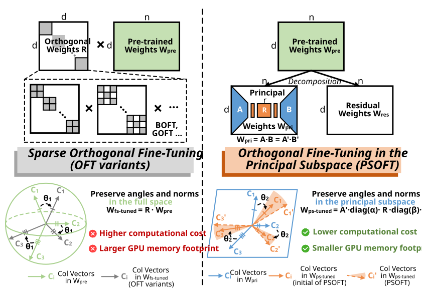

# (ICLR 2026) Efficient Orthogonal Fine-Tuning with Principal Subspace Adaptation (PSOFT) 

🎉 **[PSOFT](https://github.com/huggingface/peft/tree/main/src/peft/tuners/psoft)** is now officially integrated into the 🤗 [HuggingFace PEFT library](https://github.com/huggingface/peft) !!

🎉 **[PSOFT](https://openreview.net/forum?id=FSHrinMArK)** is accepted to [ICLR 2026](https://iclr.cc/) !! See you in **Rio de Janeiro** !! 

## Overview of PSOFT ##


PSOFT preserves the geometric structure of pre-trained weight columns—a key principle of Orthogonal Fine-Tuning (OFT)—while achieving a balanced trade-off between parameter, computation, and memory efficiency.

Unlike sparsity-based OFT variants (e.g., [OFTv1](https://huggingface.co/papers/2306.07280)/[OFTv2](https://huggingface.co/papers/2506.19847), [BOFT](https://huggingface.co/papers/2311.06243), [GOFT](https://github.com/ArthurLeoM/peft-givens)), PSOFT adopts a low-rank principal subspace formulation that bridges LoRA and OFT. By restricting orthogonal transformations to a principal subspace, PSOFT provides theoretical guarantees through orthogonality constraints, while maintaining practical flexibility via two lightweight scaling vectors.

Extensive experiments across 35 NLP and CV tasks on four representative models demonstrate that PSOFT delivers strong semantic preservation, expressiveness, and multi-dimensional efficiency in PEFT.

## Quickstart and Examples
```python
import torch
from peft import PsoftConfig, get_peft_model
from transformers import AutoTokenizer, AutoModelForCausalLM
from trl import SFTConfig, SFTTrainer
from datasets import load_dataset

model_name = "facebook/opt-125m"

model = AutoModelForCausalLM.from_pretrained(model_name)
tokenizer = AutoTokenizer.from_pretrained(model_name)
tokenizer.pad_token_id = tokenizer.eos_token_id

psoft_config = PsoftConfig(
    r=32,
    psoft_alpha=32,
)

peft_model = get_peft_model(model, psoft_config)
peft_model.print_trainable_parameters()

dataset = load_dataset("imdb", split="train[:1%]")

training_args = SFTConfig(dataset_text_field="text", max_length=128)

trainer = SFTTrainer(
    model=peft_model,
    args=training_args,
    train_dataset=dataset,
    processing_class=tokenizer,
)

trainer.train()
peft_model.save_pretrained("psoft-opt-125m")
```

More details please refer to [package_reference](https://github.com/huggingface/peft/blob/main/docs/source/package_reference/psoft.md),  [examples](https://github.com/huggingface/peft/tree/main/examples/psoft_finetuning) and [method_comparison](https://github.com/huggingface/peft/tree/main/method_comparison/MetaMathQA) in 🤗 [HuggingFace PEFT library](https://github.com/huggingface/peft).


## Best Practices

> [!TIP]
> - **Rank Choice**: Smaller ranks (e.g., `32–128`) work well for simpler tasks, while larger ranks (e.g., `64–256`) increase expressiveness at the cost of additional parameters and computation.
> - **Scaling Factor**: In our experiments, the scaling factor is typically set to `r`.
> - **Learning Rate**: Standard learning rates (e.g., `1e-4` to `5e-3`) generally provide stable training.
> - **SVD Initialization**: The `lowrank` option is more memory- and compute-efficient than `full`, making it preferable for large models.
> - **Cayley–Neumann Approximation**: For large ranks, enabling the Cayley–Neumann approximation improves efficiency. A small number of Neumann terms (typically `5`) usually offers a good balance between accuracy and speed.


## Experiments of PSOFT
The experiments are organized as follows:

* [1-NLU](1-NLU/):  Fine-tuning and evaluation on the _GLUE_ benchmarks.
* [2-Vision](2-Vision/): Fine-tuning and evaluation on the _VTAB-1K_ benchmarks.
* [3-Math](3-Math/):  Fine-tuning on _MetaMathQA-40K_ and evaluation on the _GSM-8K_ and _MATH_ datasets.
* [4-Commonsense](4-Commonsense/): Fine-tuning on _Commonsense-15K_ and evaluation on the _Commonsense Reasoning_ benchmarks.

### Step 0. Preparations
Replace `prefix: /home/[yourworkspace]/anaconda3/envs/psoft` entry in the last line of psoft.yml with the path to your local workspace.
```bash
conda env create -f psoft.yml
conda activate psoft 

find . -name "*.sh" -exec chmod +x {} \;
```

Some models or datasets require permission for usage. Please log in to your Hugging Face account using an access token.

Generate your Access Token from [settings/tokens](https://huggingface.co/settings/tokens) and log in. 
```bash
huggingface-cli login
Access Tokens:[Copy and paste your Access Tokens]
```

### Step 1. Natural Language Understanding 

**Fine-tune** and **evaluate** using the [DeBERTaV3-base](https://huggingface.co/microsoft/deberta-v3-base) model:

```bash
cd 1-NLU/script/
./deberta_v3_base_psoft-cola.sh
```

### Step 2. Visual Classification

**Fine-tune** and **evaluate** using the [ViT-base/16](https://huggingface.co/google/vit-base-patch16-224-in21k) model:

```bash
cd script/
./vit_base-psoft.sh
```

### Step 3. Mathematical Question Answering

**Fine-tune** using the [Llama-3.2-3B](https://huggingface.co/meta-llama/Llama-3.2-3B) model:
```bash
cd Math/script/
./llama-3-3b-psoft.sh
```

Before running the script please change the path name in [eval_all.sh](3-Math/) to match the path of results:
```bash
cd ../
./eval_all.sh
```

### Step 4. Commonsense Reasoning

**Fine-tune** using the [Llama-3.1-8B](https://huggingface.co/meta-llama/Llama-3.1-8B) model:

```bash
cd Commonsense/script/
./llama-3-8b-psoft.sh
```

Prepare datasets before **evaluation**:

```bash
cd /PSOFT/..
git clone https://github.com/AGI-Edgerunners/LLM-Adapters.git
cd LLM-Adapters
mkdir -p ../PSOFT/Commonsense/dataset
cp -r dataset/* ../PSOFT/Commonsense/dataset
```

Edit the path in [eval_all.sh](4-Commonsense/) to match the results directory:

```bash
cd /PSOFT/Commonsense/
./eval_all.sh
```


## Citation
Please cite our paper if PSOFT provides insights or inspiration for your work:
```
@inproceedings{wu2026efficient,
title={Efficient Orthogonal Fine-Tuning with Principal Subspace Adaptation},
author={Wu, Fei and Hu, Jia and Min, Geyong and Wang, Shiqiang},
booktitle={The Fourteenth International Conference on Learning Representations},
year={2026},
url={https://openreview.net/forum?id=FSHrinMArK}
}
```
